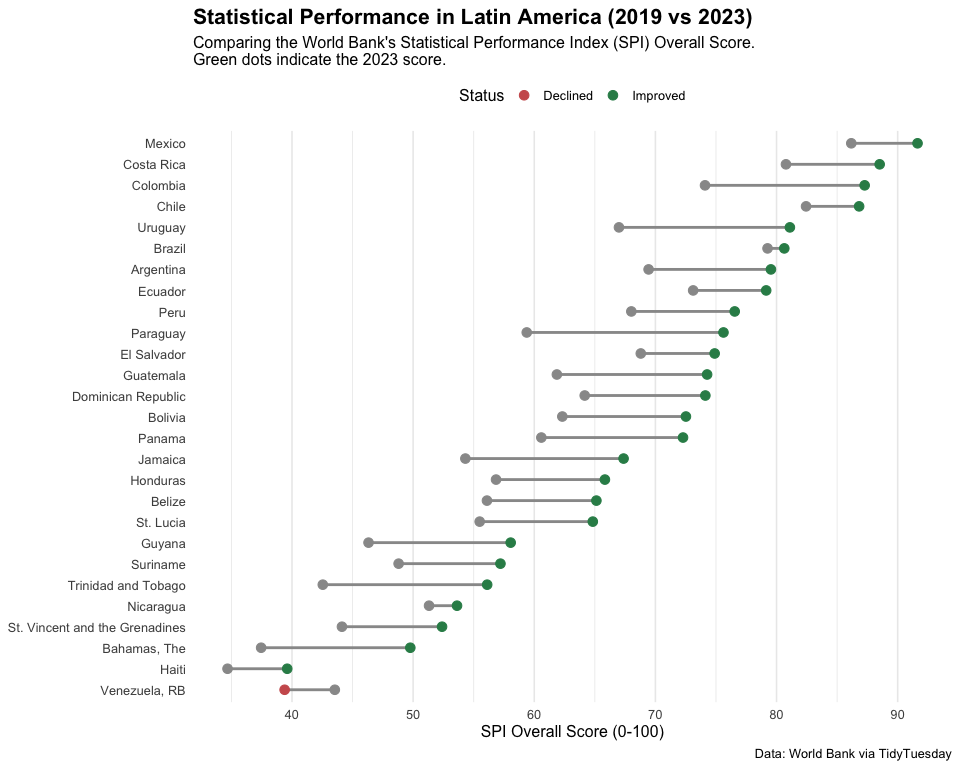

# Tidy Tuesday Week 14: Statistical Performance Indicators
Kent Glover

## 1. Introduction and Setup

This week we are analyzing the World Bank’s **Statistical Performance
Indicators (SPI)**. The goal is to see how country statistical systems
have improved (or declined) over time.

For my “New Thing” this week, I am creating a **Dumbbell Chart** to
visualize the change in scores between two specific years.

``` r
library(tidyverse)
library(here)

#set a good theme
theme_set(theme_minimal(base_size = 12))
```

## 2. Load Data

I am pulling the data directly from the TidyTuesday repository.

``` r
#read directly from Github
spi_indicators <- readr::read_csv('https://raw.githubusercontent.com/rfordatascience/tidytuesday/main/data/2025/2025-11-25/spi_indicators.csv')


#quick look
glimpse(spi_indicators)
```

    Rows: 4,340
    Columns: 12
    $ iso3c                     <chr> "DNK", "FIN", "POL", "SWE", "ESP", "NLD", "S…
    $ country                   <chr> "Denmark", "Finland", "Poland", "Sweden", "S…
    $ region                    <chr> "Europe & Central Asia", "Europe & Central A…
    $ income                    <chr> "High income", "High income", "High income",…
    $ year                      <dbl> 2023, 2023, 2023, 2023, 2023, 2023, 2023, 20…
    $ population                <dbl> 5946952, 5584264, 36685849, 10536632, 483733…
    $ overall_score             <dbl> 95.25583, 95.11542, 94.65375, 94.41000, 94.3…
    $ data_use_score            <dbl> 100, 100, 100, 100, 100, 100, 100, 100, 100,…
    $ data_services_score       <dbl> 98.46667, 96.43333, 97.30000, 96.00000, 91.2…
    $ data_products_score       <dbl> 90.71250, 90.96875, 84.54375, 90.57500, 92.6…
    $ data_sources_score        <dbl> 87.100, 88.175, 91.425, 85.475, 87.800, 83.6…
    $ data_infrastructure_score <dbl> 100, 100, 100, 100, 100, 100, 100, 100, 100,…

## 3. Data Wrangling

To create a clean visualization, I need to subset the data.

1.  I will focus on the **“Latin America & Caribbean”** region to keep
    the number of countries manageable.
2.  I will compare the `overall_score` between the years **2019** and
    **2023** to see recent changes.
3.  I need to pivot the data `wider` so I have separate columns for 2019
    and 2023 to draw the “dumbbell” lines between them.

<!-- end list -->

``` r
#Filter for region and years of interest
dumbbell_data <- spi_indicators %>%
  filter(region == "Latin America & Caribbean") %>%
  filter(year %in% c(2019, 2023)) %>%
  select(country, year, overall_score) %>%
  #pivot wider to get start and end points for the segments
  pivot_wider(names_from = year, values_from = overall_score, names_prefix = "year_") %>%
  #remove countries that don't have data for both years
  drop_na() %>%
  #calculate the change for sorting and coloring
  mutate(change = year_2023 - year_2019,
         direction = ifelse(change > 0, "Improved", "Declined")) %>%
  # reorder country factor by 2023 score so the plot is sorted
  mutate(country = fct_reorder(country, year_2023))

head(dumbbell_data)
```

    # A tibble: 6 × 5
      country    year_2023 year_2019 change direction
      <fct>          <dbl>     <dbl>  <dbl> <chr>    
    1 Mexico          91.6      86.2   5.47 Improved 
    2 Costa Rica      88.5      80.8   7.73 Improved 
    3 Colombia        87.3      74.1  13.2  Improved 
    4 Chile           86.8      82.4   4.38 Improved 
    5 Uruguay         81.1      67.0  14.1  Improved 
    6 Brazil          80.6      79.3   1.38 Improved 

## 4. Visualization: The “New Thing”

> [!NOTE]
>
> ### My “New Thing”: The Dumbbell Chart
>
> Instead of using a clustered bar chart, I learned how to build a
> **Dumbbell Chart** using `geom_segment()` and `geom_point()`.
>
> This is considered a best practice for “Before vs. After” comparisons
> because it reduces visual clutter and clearly shows the *distance* and
> *direction* of change.

``` r
#create plot
p_dumbbell <- ggplot(dumbbell_data) +
  # 1.The "bar" of the dumbbell (the segment connecting the years)
  geom_segment(aes(x = year_2019, xend = year_2023, 
                   y = country, yend = country), 
               color = "grey60", size = 1) +
  
  # 2.Point for 2019 (Start)
  geom_point(aes(x = year_2019, y = country), 
             color = "grey60", size = 3) +
  
  # 3.Point for 2023 (End) colored by improvement status
  geom_point(aes(x = year_2023, y = country, color = direction), 
             size = 3) +
  
  #custom colors for the direction
  scale_color_manual(values = c("Improved" = "#2E8B57", "Declined" = "#CD5C5C")) +
  
  #better labels
  labs(title = "Statistical Performance in Latin America (2019 vs 2023)",
       subtitle = "Comparing the World Bank's Statistical Performance Index (SPI) Overall Score.\nGreen dots indicate the 2023 score.",
       x = "SPI Overall Score (0-100)",
       y = NULL,
       color = "Status",
       caption = "Data: World Bank via TidyTuesday") +
  
  #theme adjustments for cleanliness
  theme(
    legend.position = "top",
    panel.grid.major.y = element_blank(), #remove horizontal grid lines
    plot.title = element_text(face = "bold", size = 16)
  )
```

    Warning: Using `size` aesthetic for lines was deprecated in ggplot2 3.4.0.
    ℹ Please use `linewidth` instead.

``` r
#display
p_dumbbell
```



``` r
#Save Output
ggsave(here("Tidy_Tuesday", "Week_14", "Outputs", "spi_dumbbell_plot.png"), 
       p_dumbbell, width = 10, height = 8)
```

## 5. Summary

By using the **Dumbbell Chart**, we can easily identify that while most
countries in the region improved their statistical capacity (like
**Mexico** and **Chile**), a few saw declines. This visualization is
much cleaner than trying to read two bars side-by-side for each country.
