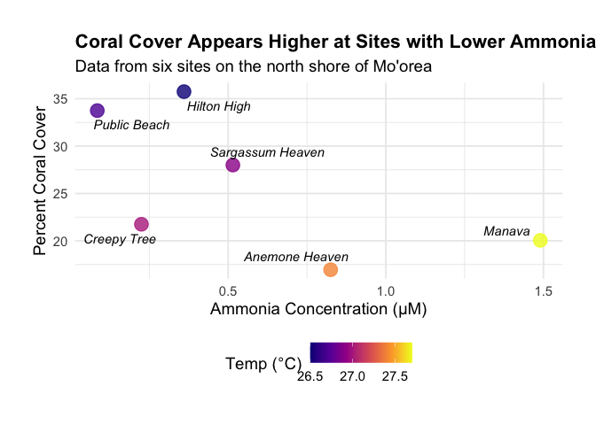

# Kent’s Week 6 Homework
Kent Glover
2025-10-05

<script src="Week6HW_files/libs/kePrint-0.0.1/kePrint.js"></script>
<link href="Week6HW_files/libs/lightable-0.0.1/lightable.css" rel="stylesheet" />

## Introduction

The main goal here is to whip up a publication-quality figure and table
to complete the Week 6 Homework objectives using the Mo’orea data!

------------------------------------------------------------------------

## 1. Packages and Data

First, load up the R packages needed. **`tidyverse`** is for data
wrangling and plotting, **`here`** helps keep file paths easy,
**`kableExtra`** helps with tables, and **`ggrepel`** will keep plot
labels from overlapping.

``` r
library(tidyverse)
library(here)
library(kableExtra)
library(ggrepel)
```

With the packages loaded, now to pull in the
`site.characteristics.data.csv` data and take a peek with `glimpse()` to
make sure everything looks right.

``` r
#Read the data using the here()
moorea_data <- read_csv(here("Week_05", "Data", "site.characteristics.data.csv"))
```

    Rows: 78 Columns: 5
    ── Column specification ────────────────────────────────────────────────────────
    Delimiter: ","
    chr (3): name, site.letter, parameter.measured
    dbl (2): site.block, values

    ℹ Use `spec()` to retrieve the full column specification for this data.
    ℹ Specify the column types or set `show_col_types = FALSE` to quiet this message.

``` r
#Look at the data
glimpse(moorea_data)
```

    Rows: 78
    Columns: 5
    $ name               <chr> "Anemone Heaven", "Hilton High", "Public Beach", "M…
    $ site.letter        <chr> "F", "C", "B", "E", "D", "A", "F", "C", "B", "E", "…
    $ site.block         <dbl> 1, 2, 3, 1, 2, 3, 1, 2, 3, 1, 2, 3, 1, 2, 3, 1, 2, …
    $ parameter.measured <chr> "light", "light", "light", "light", "light", "light…
    $ values             <dbl> 1674.241, 1193.230, 2647.890, 1533.245, 2114.013, 2…

------------------------------------------------------------------------

## 2. Reshaping the Data

The dataset is currently in a “long” format. I’ll reshape it into a
“wide” format, where each row is a unique site and each measurement gets
its own column. For this analysis, I’m only grabbing the columns for
**`coral.cover`**, **`NH4`**, and **`temp`**.

``` r
#Filter for the parameters needed, then pivot to a wide format
wide_data <- moorea_data %>%
  filter(parameter.measured %in% c("coral.cover", "NH4", "temp")) %>%
  pivot_wider(names_from = parameter.measured, values_from = values) %>%
  select(name, coral.cover, NH4, temp) # Reorder for clarity

#Check it
wide_data
```

    # A tibble: 6 × 4
      name             coral.cover   NH4  temp
      <chr>                  <dbl> <dbl> <dbl>
    1 Anemone Heaven          17.0 0.825  27.4
    2 Hilton High             35.8 0.36   26.5
    3 Public Beach            33.8 0.085  26.7
    4 Manava                  20.0 1.49   27.7
    5 Sargassum Heaven        28   0.515  26.9
    6 Creepy Tree             21.8 0.225  27  

------------------------------------------------------------------------

## 3. Figure: Coral Cover vs. Ammonia

Is there a visual connection between coral cover and ammonia? I’ll put
`NH4` on the x-axis, `coral.cover` on the y-axis of a scatterplot, and
label each point with its site name.

``` r
ggplot(wide_data, aes(x = NH4, y = coral.cover)) +
  geom_point(aes(color = temp), size = 5, alpha = 0.8) +
  #Was having issues with overlapping text so using geom_text_repel to make sure labels don't overlap
  geom_text_repel(aes(label = name), 
                  fontface = "italic", 
                  box.padding = 0.5, 
                  max.overlaps = Inf,
                  segment.color = NA) + #hides the lines connecting labels to points that I thought were unnecessary
  #Tweak the legend and expand the plot area to prevent cutoff
  scale_color_viridis_c(option = "plasma", breaks = c(26.5, 27.0, 27.5)) + 
  coord_cartesian(clip = "off") + #labels can sit outside the main plot
  labs(
    title = "Coral Cover Appears Higher at Sites with Lower Ammonia",
    subtitle = "Data from six sites on the north shore of Mo'orea",
    x = "Ammonia Concentration (μM)",
    y = "Percent Coral Cover",
    color = "Temp (°C)"
  ) +
  theme_minimal(base_size = 14) +
  theme(
    plot.title = element_text(face = "bold", size = 16),
    legend.position = "bottom",
    #Was still having problems so added some breathing room around the plot for labels
    plot.margin = margin(1, 1, 1, 1, "cm") 
  )
```

<div id="fig-coral-nh4">



Figure 1: A scatter plot exploring the link between percent coral cover
and ammonia (NH4) concentration across six sites in Mo’orea. Points are
colored by the site’s average temperature.

</div>

------------------------------------------------------------------------

## 4. Table: Quick Site Summary

Using `kableExtra`, I can lay out the key stats for each site. To draw
attention to the site with the most coral, I highlighted the **Hilton
High** row.

``` r
wide_data %>%
  #Sort the data to bring the site with the highest coral cover to the top
  arrange(desc(coral.cover)) %>% 
  
  #build the table with kable
  kbl(
    col.names = c("Site Name", "Coral Cover (%)", "Ammonia (μM)", "Temperature (°C)"),
    align = "lccc",
    caption = "Site Data Summary"
  ) %>%
  
  #Add styling
  kable_styling(bootstrap_options = c("striped", "hover"), full_width = FALSE) %>%
  
  #Highlight the first row
  row_spec(1, bold = TRUE, color = "white", background = "#4E79A7") 
```

<div id="tbl-site-summary">

Table 1: A summary table of percent coral cover, ammonia (NH4)
concentration, and temperature for the six study sites in Mo’orea.

<div class="cell-output-display">

| Site Name        | Coral Cover (%) | Ammonia (μM) | Temperature (°C) |
|:-----------------|:---------------:|:------------:|:----------------:|
| Hilton High      |      35.75      |    0.360     |       26.5       |
| Public Beach     |      33.75      |    0.085     |       26.7       |
| Sargassum Heaven |      28.00      |    0.515     |       26.9       |
| Creepy Tree      |      21.75      |    0.225     |       27.0       |
| Manava           |      20.05      |    1.490     |       27.7       |
| Anemone Heaven   |      16.95      |    0.825     |       27.4       |

Site Data Summary

</div>

</div>

------------------------------------------------------------------------

## Conclusion

Both the plot and the table give a pretty clear picture of the Mo’orea
data. Looking at
**<a href="#fig-coral-nh4" class="quarto-xref">Figure 1</a>**, it seems
like there’s a trend where lower ammonia levels are found at sites with
more coral. **Hilton High**, which stands out in
**<a href="#tbl-site-summary" class="quarto-xref">Table 1</a>** with the
highest coral cover, also has one of the lowest ammonia concentrations.
This shows that nutrient levels might be playing a significant role in
the reef’s health. This reminds me of how much nutrient levels matter in
reef aquariums, but instead of doing a water change on my tanks I did
this Homework :)
