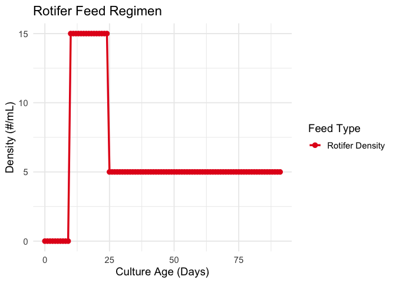
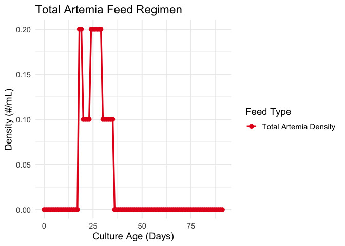
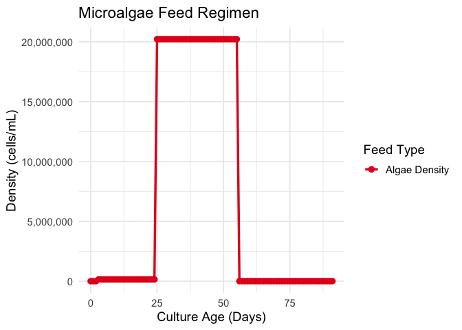
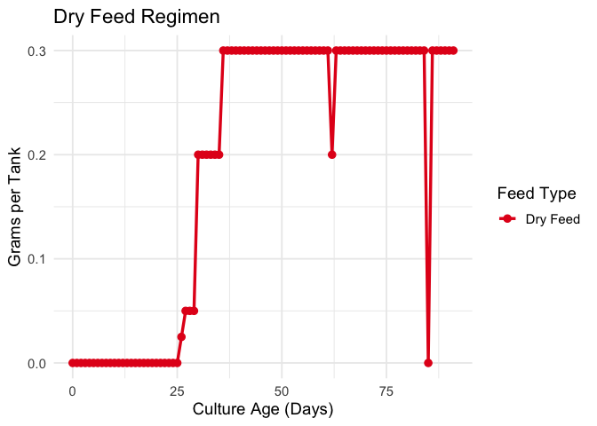

# Week 10 Homework - Functions
Kent Glover

## 1. Introduction

Alright, here’s the homework. This document has the two custom R
functions as requested, both for chewing on the `run41_feed_long.csv`
data, which itself was pried from my lab’s horrible Excel sheet that
makes me want to tear my eyeballs out with a spork.

1.  `plot_feeding_regimen()`: The plotting function. Makes lines go up
    and down and right.
2.  `summarize_run_parameters()`: The non-plotting one. Spits out a
    table of stats (mean, min, max).

## 2. Setup and Data Loading

Dumping all the libraries we need. `tidyverse` for the `dplyr`/`ggplot2`
magic, `knitr` for the pretty tables, and the rest to wrangle paths,
strings, and data structures.

``` r
# Load required libraries
library(tidyverse)
library(readr)
library(here)
library(knitr)
library(stringr) 
library(tidyr)   
library(scales)  
```

### Helper Function for Parsing Feed

The data is, of course, a complete mess because it came from *that*
Excel sheet. This helper function exists purely to deal with the
nonsense strings in the `value` column, like “150k” (which means
150,000) and “10+5” (which means 15).

``` r
#' Function to fix the god-awful 'value' column.
#' Tries to guess if '150k' means 150,000 or if '10+5' means 15.
#' Also strips "cells/mL" and other garbage.
parse_feed_value <- function(x) {
  
  # If it's empty, it's empty. Get out.
  if (is.na(x) || x == "") {
    return(NA_real_)
  }
  
  # 1. Nuke everything that isn't a number, '.', '+', or 'k'.
  x_clean <- str_remove_all(x, "[^0-9\\.\\+kK]")
  x_lower <- tolower(x_clean)

  # 2. If it was just "AP" or "cells/mL", it's now "". So, again, get out.
  if (x_lower == "") {
    return(NA_real_)
  }

  # 3. The 'k' notation. Why.
  if (grepl("k$", x_lower)) {
    val_no_k <- str_remove(x_lower, "k$")
    suppressWarnings({
      val_num <- as.numeric(val_no_k)
      if (!is.na(val_num)) {
        # Just in case someone wrote "150,000k". Don't multiply *that* by 1000.
        if (val_num > 1000) {
          return(val_num)
        } else {
          # The "normal" (but still annoying) case. 150k -> 150000.
          return(val_num * 1000)
        }
      }
    })
  }
  
  # 4. The '10+5' notation. Double why.
  if (grepl("\\+", x_lower)) {
    parts <- unlist(str_split(x_lower, "\\+"))
    val_sum <- sum(as.numeric(parts), na.rm = TRUE)
    if (any(!is.na(as.numeric(parts)))) {
      return(val_sum)
    }
  }
  
  # 5. If it got this far, just pray it's a normal number.
  suppressWarnings({
    return(as.numeric(x_lower))
  })
}

#' Vectorize this nightmare so it can run on the whole column at once.
parse_feed_value_vec <- function(col) {
  sapply(col, parse_feed_value)
}
```

### Loading and Cleaning the Data

Now to actually load this thing and run our parser over it.

``` r
# Path to the data. Please be here.
file_path <- here("Week_10", "Data", "run41_feed_long.csv")

# Read it in.
raw_data <- read_csv(file_path, show_col_types = FALSE)

# Let's clean this up.
hatchery_data <- raw_data %>%
  # Rename 'age' because 'culture_age_days' is apparently "better".
  rename(culture_age_days = age) %>%
  # Run our parser function on the disastrous 'value' column.
  mutate(
    value = parse_feed_value_vec(value),
    culture_age_days = as.numeric(culture_age_days)
  )

# Glimpse it to make sure it didn't totally break.
glimpse(hatchery_data)
```

    Rows: 1,067
    Columns: 4
    $ culture_age_days <dbl> 0, 1, 2, 4, 5, 6, 7, 8, 9, 10, 11, 12, 13, 14, 15, 16…
    $ date             <date> 2025-08-03, 2025-08-04, 2025-08-05, 2025-08-07, 2025…
    $ feed_type        <chr> "feed_1", "feed_1", "feed_1", "feed_1", "feed_1", "fe…
    $ value            <dbl> NA, NA, NA, NA, NA, NA, NA, NA, NA, NA, NA, NA, NA, N…

### Data Processing: Sum Total Artemia Feed

I have to sum up four different columns (`feed_32`, `feed_35`,
`feed_36`, `feed_37`) and pretend it was one thing all along.

``` r
# These are all the 'Artemia' columns to sum.
artemia_types <- c("feed_32", "feed_35", "feed_36", "feed_37")

# Grab only those columns, group by day, and sum them.
total_artemia_data <- hatchery_data %>%
  filter(feed_type %in% artemia_types) %>%
  group_by(culture_age_days) %>%
  summarise(value = sum(value, na.rm = TRUE)) %>%
  # Slap the new 'feed_artemia_total' label on.
  mutate(feed_type = "feed_artemia_total") %>%
  ungroup() %>%
  select(culture_age_days, feed_type, value)

# Shove these new rows back into the main data frame.
hatchery_data <- bind_rows(hatchery_data, total_artemia_data)

# Glimpse again. Should have more rows now.
glimpse(hatchery_data)
```

    Rows: 1,087
    Columns: 4
    $ culture_age_days <dbl> 0, 1, 2, 4, 5, 6, 7, 8, 9, 10, 11, 12, 13, 14, 15, 16…
    $ date             <date> 2025-08-03, 2025-08-04, 2025-08-05, 2025-08-07, 2025…
    $ feed_type        <chr> "feed_1", "feed_1", "feed_1", "feed_1", "feed_1", "fe…
    $ value            <dbl> NA, NA, NA, NA, NA, NA, NA, NA, NA, NA, NA, NA, NA, N…

## 3. Function Definitions

Okay, here are the actual functions for the assignment.

``` r
#' Function 1: The Plotting One.
#'
#' @param data Long-format data frame. Needs 'culture_age_days', 'feed_type', 'value'.
#' @param feed_types_to_plot A vector of the 'feed_xx' names you want.
#' @param plot_title Title for the plot.
#' @param y_axis_label Label for the y-axis.
#'
#' @return A ggplot object.
plot_feeding_regimen <- function(data, 
                                 feed_types_to_plot, 
                                 plot_title, 
                                 y_axis_label = "Amount Added") {
  
  # A lookup vector to make the plot legend look like English.
  feed_name_lookup <- c(
    "feed_14" = "Algae Density",
    "feed_21" = "Copepod Density",
    "feed_27" = "Rotifer Density",
    "feed_32" = "Artemia - Newly Hatched",
    "feed_35" = "ArtemIA - Enriched (BGs AM)",
    "feed_36" = "Artemia - Enriched (BGs PM)",
    "feed_37" = "Artemia - Enriched (Density)",
    "feed_39" = "Dry Feed",
    "feed_artemia_total" = "Total Artemia Density"
  )
  
  # 1. Grab only the feed types we actually want.
  data_to_plot_original <- data %>%
    filter(feed_type %in% feed_types_to_plot) %>%
    # 2. Slap on the readable names for the legend.
    mutate(feed_name = recode(feed_type, !!!feed_name_lookup))
    
  # 3. Make a "perfect" grid of all days for all selected feeds.
  # This is to fix missing data so the lines don't break.
  date_range <- tidyr::full_seq(data$culture_age_days, 1)
  unique_feeds <- unique(data_to_plot_original$feed_name)
  
  data_grid <- tidyr::expand_grid(feed_name = unique_feeds, 
                                culture_age_days = date_range) %>%
    filter(!is.na(culture_age_days))
    
  # 4. Join the (messy) real data to the (clean) grid.
  data_to_plot <- data_grid %>%
    left_join(
      data_to_plot_original, 
      by = c("feed_name", "culture_age_days")
    ) %>%
    # 5. Group by feed_name. CRITICAL. So fill() doesn't bleed data across feeds.
    group_by(feed_name) %>%
    # 6. Last Observation Carried Forward (LOCF).
    # This makes '150k on day 0' into a flat line until the next value.
    tidyr::fill(value, .direction = "down") %>%
    # 7. Anything *still* NA (e.g., at the start) is 0.
    mutate(value = replace_na(value, 0)) %>%
    ungroup()

  # 8. Finally, make the plot.
  ggplot(data_to_plot, aes(x = culture_age_days, y = value, color = feed_name)) +
    geom_line(linewidth = 1.2) +
    geom_point(size = 2.5) +
    labs(
      title = plot_title,
      x = "Culture Age (Days)",
      y = y_axis_label
    ) +
    theme_minimal(base_size = 14) +
    scale_color_brewer(palette = "Set1", name = "Feed Type")
}


#' Function 2: The Summary Stats One.
#'
#' @param data Long-format data frame.
#' @param param_types_to_summarize A vector of 'feed_xx' names to summarize.
#'
#' @return A data frame with Mean, Min, Max.
summarize_run_parameters <- function(data, param_types_to_summarize) {
  
  # Another lookup vector. Copy-pasted from above.
  param_name_lookup <- c(
    "feed_4" = "Temp (C)",
    "feed_6" = "Salinity (ppt)",
    "feed_8" = "pH",
    "feed_14" = "Algae Density",
    "feed_21" = "Copepod Density",
    "feed_27" = "Rotifer Density",
    "feed_32" = "Artemia - Newly Hatched",
    "feed_35" = "Artemia - Enriched (BGs AM)",
    "feed_36" = "Artemia - Enriched (BGs PM)",
    "feed_37" = "Artemia - Enriched (Density)",
    "feed_39" = "Dry Feed",
    "feed_artemia_total" = "Total Artemia Density"
  )
  
  # The actual work.
  param_summary <- data %>%
    filter(feed_type %in% param_types_to_summarize) %>%
    # 1. Get rid of NAs or the stats functions will cry.
    filter(!is.na(value)) %>%
    # 2. Group and calculate stats.
    group_by(feed_type) %>%
    summarise(
      # 3. Check for n() > 0 so we don't get -Inf/Inf if a group is empty.
      Mean = ifelse(n() > 0, mean(value, na.rm = TRUE), 0),
      Min = ifelse(n() > 0, min(value, na.rm = TRUE), 0),
      Max = ifelse(n() > 0, max(value, na.rm = TRUE), 0),
      .groups = "drop" # Avoid the .groups warning
    ) %>%
    # 4. Add readable names.
    mutate(Parameter = recode(feed_type, !!!param_name_lookup)) %>%
    # 5. Make the table look nice.
    select(Parameter, Mean, Min, Max)
  
  return(param_summary)
}
```

## 4. Function Examples

Here are the examples to prove they work.

### Example 1: Plot Function (`plot_feeding_regimen`)

#### Example 1.1: Plotting Rotifer Feed

``` r
# Plotting Rotifers.
plot_feeding_regimen(
  data = hatchery_data,
  feed_types_to_plot = c("feed_27"),
  plot_title = "Rotifer Feed Regimen",
  y_axis_label = "Density (#/mL)"
)
```



#### Example 1.2: Plotting Total Artemia Feed

``` r
# Plotting the "Total Artemia" we made earlier.
plot_feeding_regimen(
  data = hatchery_data,
  feed_types_to_plot = c("feed_artemia_total"),
  plot_title = "Total Artemia Feed Regimen",
  y_axis_label = "Density (#/mL)"
)
```



#### Example 1.3: Plotting Microalgae

``` r
# Plotting Algae.
plot_feeding_regimen(
  data = hatchery_data,
  feed_types_to_plot = c("feed_14"),
  plot_title = "Microalgae Feed Regimen",
  y_axis_label = "Density (cells/mL)"
) + 
  # Add commas to the y-axis, because 1.5e+05 is ugly.
  scale_y_continuous(labels = scales::comma)
```



#### Example 1.4: Plotting Dry Feed

``` r
# Plotting Dry Feed.
plot_feeding_regimen(
  data = hatchery_data,
  feed_types_to_plot = c("feed_39"),
  plot_title = "Dry Feed Regimen",
  y_axis_label = "Grams per Tank"
)
```



### Example 2: Non-Plot Function (`summarize_run_parameters`)

#### Example 2.1: Summarizing Physical Parameters

``` r
# Example 2.1: Physical stuff.
physical_types <- c("feed_4", "feed_6", "feed_8")

summary1 <- summarize_run_parameters(
  data = hatchery_data,
  param_types_to_summarize = physical_types
)

# Make it a kable.
knitr::kable(
  summary1, 
  caption = "Summary of Physical Parameters",
  digits = 2
)
```

| Parameter | Mean | Min | Max |
|:----------|-----:|----:|----:|
| pH        | 7.56 |   0 |  10 |

Summary of Physical Parameters

#### Example 2.2: Summarizing Feed Parameters

``` r
# Example 2.2: Feed stuff.
feed_types_to_summarize <- c("feed_27", "feed_artemia_total", "feed_39")

summary2 <- summarize_run_parameters(
  data = hatchery_data,
  param_types_to_summarize = feed_types_to_summarize
)

# Make it a kable.
knitr::kable(
  summary2, 
  caption = "Summary of Feed Amounts Added",
  digits = 2
)
```

| Parameter             |  Mean | Min |  Max |
|:----------------------|------:|----:|-----:|
| Rotifer Density       | 10.77 |   5 | 15.0 |
| Dry Feed              |  0.27 |   0 |  0.3 |
| Total Artemia Density |  0.13 |   0 |  0.2 |

Summary of Feed Amounts Added

## 5. Conclusion

And… done. The functions work, the plots plot?, the tables tabulate.
