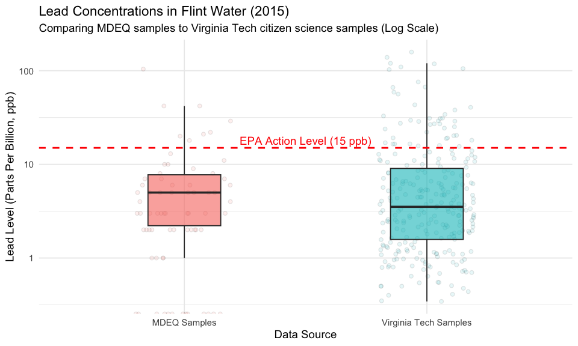

# Tidy Tuesday: Flint Water Analysis
Kent Glover

## 1. Introduction

This week’s data is from the 2015 Flint, Michigan water crisis, and is
provided in two separate files: one from the Michigan Department of
Environment (MDEQ) and one from a Virginia Tech (VT) citizen science
project.

## 2. Setup and Data Loading

This chunk loads all necessary packages for the analysis. `tidyverse` is
used for data manipulation, `tidytuesdayR` for loading the data, and
`ggridges` for the “new skill” visualization.

``` r
# Load required libraries
library(tidyverse)
library(tidytuesdayR) # For loading Tidy Tuesday data
library(ggridges)     # For the "new thing" visualization
library(here)
```

### 2.1. Load the Data

We use the `tt_load` function to download the data for 2025-11-04. Based
on the `readme`, this load object contains two data frames: `flint_mdeq`
and `flint_vt`.

``` r
# Load the Tidy Tuesday dataset for 2025-11-04
tuesdata <- tidytuesdayR::tt_load('2025-11-04')
```

    ---- Compiling #TidyTuesday Information for 2025-11-04 ----
    --- There are 2 files available ---


    ── Downloading files ───────────────────────────────────────────────────────────

      1 of 2: "flint_mdeq.csv"
      2 of 2: "flint_vt.csv"

``` r
# Access the data frames by their correct names
flint_mdeq <- tuesdata$flint_mdeq
flint_vt <- tuesdata$flint_vt

# Glimpse them to see what we're dealing with
glimpse(flint_mdeq)
```

    Rows: 71
    Columns: 4
    $ sample <dbl> 1, 2, 3, 4, 5, 6, 7, 8, 9, 10, 11, 12, 13, 14, 15, 16, 17, 18, …
    $ lead   <dbl> 0, 104, 10, 6, 5, 0, 3, 0, 13, 4, 8, 6, 2, 1, 1, 0, 2, 7, 3, 5,…
    $ lead2  <dbl> 0, NA, 10, 6, 5, 0, 3, 0, 13, 4, 8, 6, 2, 1, 1, 0, 2, 7, 3, 5, …
    $ notes  <chr> NA, "sample removed: house had a filter", NA, NA, NA, NA, NA, N…

``` r
glimpse(flint_vt)
```

    Rows: 271
    Columns: 2
    $ sample <dbl> 1, 2, 3, 4, 5, 6, 7, 8, 9, 10, 11, 12, 13, 14, 15, 16, 17, 18, …
    $ lead   <dbl> 0.344, 0.349, 0.400, 0.410, 0.438, 0.475, 0.500, 0.500, 0.501, …

## 3. Data Wrangling

The goal is to compare the distributions of lead levels from the two
sources. The best way to do this is to combine them into a single, tidy
data frame.

We’ll select the `lead` column from each, create a new `data_source`
column to label them, and then use `bind_rows()` to stack them.

``` r
# Tidy the MDEQ data (using the 'lead' column)
mdeq_tidy <- flint_mdeq %>%
  select(lead) %>%
  mutate(data_source = "MDEQ Samples")

# Tidy the Virginia Tech (VT) data
vt_tidy <- flint_vt %>%
  select(lead) %>%
  mutate(data_source = "Virginia Tech Samples")

# Combine them into one long data frame
combined_data <- bind_rows(mdeq_tidy, vt_tidy) %>%
  # Remove NAs
  drop_na(lead) %>% 
  # Make data_source a factor
  mutate(data_source = as.factor(data_source))

# Check the new structure
glimpse(combined_data)
```

    Rows: 342
    Columns: 2
    $ lead        <dbl> 0, 104, 10, 6, 5, 0, 3, 0, 13, 4, 8, 6, 2, 1, 1, 0, 2, 7, …
    $ data_source <fct> MDEQ Samples, MDEQ Samples, MDEQ Samples, MDEQ Samples, MD…

## 4. Visualization 1: Static Plot

Because the lead data has extreme outliers (a “long tail”), a standard
boxplot is hard to read. A better “best practice” for this type of data
is to show the boxplot on a **logarithmic scale** (`scale_y_log10()`).
This makes the distributions comparable. We also add `geom_jitter` to
show the density of individual points.

``` r
# --- Static Plot (Best Practices) ---

# The 15 ppb EPA action level 
epa_action_level <- 15

p_static <- ggplot(combined_data, aes(x = data_source, y = lead, fill = data_source)) +
  # Use geom_jitter to show all points
  geom_jitter(alpha = 0.1, width = 0.2, shape = 21, color = "black") +
  
  # Overlay the boxplot
  geom_boxplot(alpha = 0.6, outlier.shape = NA, width = 0.3) +
  
  # Add the EPA Action Level line. Critical context.
  geom_hline(
    yintercept = epa_action_level,
    color = "red",
    linetype = "dashed",
    linewidth = 1
  ) +
  
  # Add a text label for the line
  annotate("text",
    x = 1.5, y = epa_action_level + 3, 
    label = "EPA Action Level (15 ppb)",
    color = "red"
  ) +
  
  # Use a log-transformed y-axis (using + 1 to avoid log(0) issues)
  scale_y_log10(
    name = "Lead Level (Parts Per Billion, ppb)",
    labels = scales::comma_format(accuracy = 1)
  ) +
  
  # Add clear labels and titles 
  labs(
    title = "Lead Concentrations in Flint Water (2015)",
    subtitle = "Comparing MDEQ samples to Virginia Tech citizen science samples (Log Scale)",
    x = "Data Source"
  ) +
  
  theme_minimal(base_size = 14) +
  theme(legend.position = "none") # Redundant, fill matches x-axis

# Show the plot
p_static
```

    Warning in scale_y_log10(name = "Lead Level (Parts Per Billion, ppb)", labels = scales::comma_format(accuracy = 1)): log-10 transformation introduced infinite values.
    log-10 transformation introduced infinite values.

    Warning: Removed 13 rows containing non-finite outside the scale range
    (`stat_boxplot()`).



``` r
# Save the plot
ggsave(here("Week_11", "Outputs","flint_boxplot_comparison.png"), p_static, width = 10, height = 6)
```

    Warning in scale_y_log10(name = "Lead Level (Parts Per Billion, ppb)", labels =
    scales::comma_format(accuracy = 1)): log-10 transformation introduced infinite
    values.

    Warning in scale_y_log10(name = "Lead Level (Parts Per Billion, ppb)", labels =
    scales::comma_format(accuracy = 1)): log-10 transformation introduced infinite
    values.

    Warning: Removed 13 rows containing non-finite outside the scale range
    (`stat_boxplot()`).

**Plot Insight:** The plot clearly shows that the Virginia Tech samples,
which came from concerned citizens, captured *many more* extreme
high-lead readings than the official MDEQ samples. Both distributions
have medians well below the action level, but the *range* and number of
high outliers in the VT data is significantly larger.

## 5. Visualization 2: The “New Thing”

For the “new thing” requirement, I’m learning the `{ggridges}` package.
The original idea of animating (`gganimate`) is not appropriate for this
dataset, as there is no time variable to animate. A ridgeline plot is an
excellent way to compare distributions.

> [!NOTE]
>
> ### My “One New Thing” This Week (1 Point)
>
> For my new skill, I learned to use the **`{ggridges}`** package. I’m
> using `geom_density_ridges()` to create a ridgeline plot. This is a
> very clean and effective way to visualize and compare the different
> *shapes* of the two distributions, especially when plotted on a log
> scale.

``` r
# New Skill Plot

p_ridges <- ggplot(combined_data, 
       aes(x = lead, y = data_source, fill = data_source, height = after_stat(density))) +
  
  # The new geom from the {ggridges} package [4, 9, 11, 12, 5]
  geom_density_ridges(
    stat = "density",
    scale = 1.5, # Controls overlap
    alpha = 0.7,
    rel_min_height = 0.01 # Trims the long tails
  ) +
  
  # Add the EPA Action Level line
  geom_vline(
    xintercept = epa_action_level,
    color = "red",
    linetype = "dashed",
    linewidth = 1
  ) +
  
  # Add the log scale to the x-axis
  scale_x_log10(
    name = "Lead Level (Parts Per Billion, ppb)",
    labels = scales::comma_format(accuracy = 1)
  ) +
  
  # Use the built-in {ggridges} theme [4, 12, 5]
  theme_ridges(font_size = 14) +
  
  labs(
    title = "Distribution of Lead Levels (MDEQ vs. VT)",
    subtitle = "Lead (ppb) shown on a logarithmic scale",
    y = "Data Source"
  ) +
  
  theme(legend.position = "none")

# Show the plot
p_ridges
```

    Warning in scale_x_log10(name = "Lead Level (Parts Per Billion, ppb)", labels =
    scales::comma_format(accuracy = 1)): log-10 transformation introduced infinite
    values.

    Warning: Removed 13 rows containing non-finite outside the scale range
    (`stat_density()`).


``` r
# Save the plot
ggsave(here("Week_11", "Outputs", "flint_ridgeline_comparison.png"), p_ridges, width = 10, height = 6)
```

    Warning in scale_x_log10(name = "Lead Level (Parts Per Billion, ppb)", labels = scales::comma_format(accuracy = 1)): log-10 transformation introduced infinite values.
    Removed 13 rows containing non-finite outside the scale range
    (`stat_density()`).

## 6. Conclusion

I think this completed the assignment! WOOo
